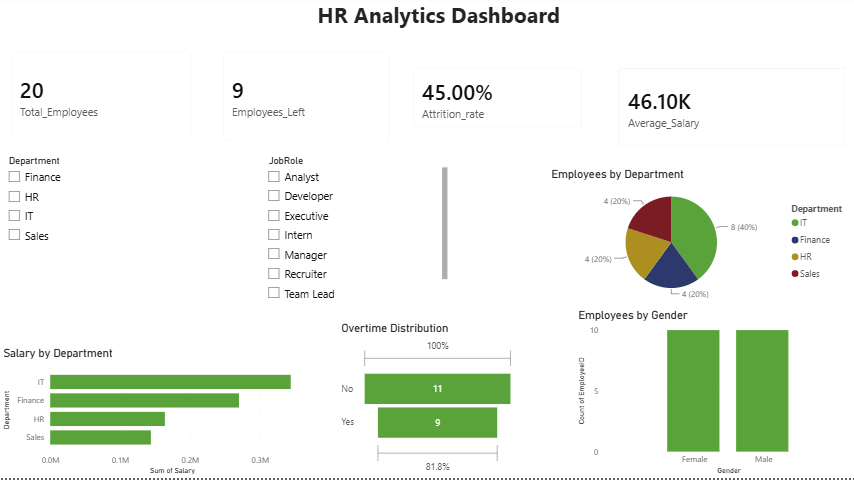

HR Analytics Dashboard

Overview

This project analyzes employee attrition, salary distribution, overtime trends, and workforce demographics using Power BI.

Tools Used

- Power BI
- DAX
- Excel

Key Metrics

- Total Employees
- Employees Left
- Attrition Rate
- Average Salary

Dashboard Preview

Insights

- Attrition Rate: 45%
- IT department has the highest workforce.
- Overtime participation is nearly balanced.
- Salary distribution varies across departments.

Author

Srishti Banerjee
